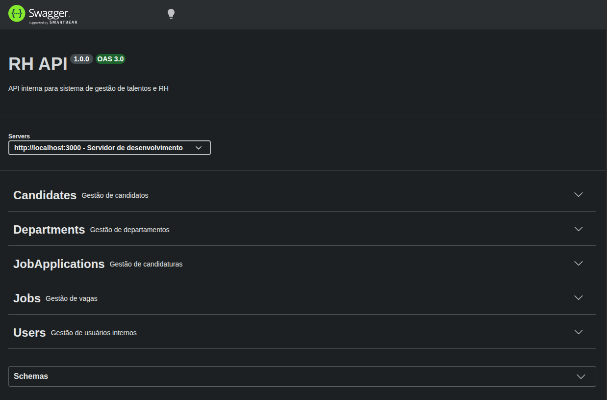

# Sistema de RH

[](https://nodejs.org/)
[](https://expressjs.com/)
[](https://www.prisma.io/)
[](https://www.docker.com/)

## 📋 Pré-requisitos

Antes de começar, você precisa ter instalado em sua máquina:

- **Node.js** - Ambiente de execução JavaScript
  - Download: [https://nodejs.org/](https://nodejs.org/)
  - Recomendado: versão LTS (Long Term Support)
  
- **npm** ou **yarn** - Gerenciadores de pacotes (já vem com o Node.js)

- **Git** - Controle de versão
  - Download: [https://git-scm.com/](https://git-scm.com/)

- **Docker** e **Docker Compose** (opcional, para execução containerizada)
  - Download: [https://www.docker.com/](https://www.docker.com/)

## 🛠️ IDE Recomendada

Recomendamos o uso do **[Visual Studio Code](https://code.visualstudio.com/)** como editor de código, com as seguintes extensões úteis:

- **ES7+ React/Redux/React-Native snippets** - snippets úteis
- **Prettier** - formatador de código
- **ESLint** - identificador de erros
- **GitLens** - visualização de histórico do Git
- **Prisma** - extensão oficial para suporte ao Prisma ORM

## 📊 Modelo de Dados (Prisma ORM)

O sistema utiliza o Prisma como ORM (Object-Relational Mapping) com as seguintes entidades principais:

### 🧑‍💼 Entidades de Usuário e RH

| Entidade | Descrição | Principais Campos |
|----------|-----------|-------------------|
| **User** | Usuários do sistema que podem criar notas internas | id, name, email, createdAt, updatedAt |
| **InternalProfile** | Perfil de funcionário interno vinculado a um candidato | employeeCode, currentJobTitle, department, manager |

### 🎯 Entidades de Recrutamento

| Entidade | Descrição | Principais Campos |
|----------|-----------|-------------------|
| **Candidate** | Candidatos a vagas com suporte a soft delete | fullName, email, phone, deletedAt |
| **Resume** | Currículo do candidato (1:1 com Candidate) | summary, fileUrl, rawText |
| **Skill** | Habilidades técnicas/comportamentais | name (único) |
| **ResumeSkill** | Relação N:N entre currículos e habilidades | resumeId, skillId |

### 📝 Entidades de Carreira e Educação

| Entidade | Descrição | Principais Campos |
|----------|-----------|-------------------|
| **ProfessionalExperience** | Experiências profissionais do candidato | companyName, jobTitle, startDate, endDate, isCurrent |
| **Education** | Formação acadêmica | institution, degree, fieldOfStudy, startDate, endDate |

### 🏢 Entidades Organizacionais

| Entidade | Descrição | Principais Campos |
|----------|-----------|-------------------|
| **Department** | Departamentos da empresa | name (único) |
| **JobPosition** | Vagas disponíveis | title, description, status (OPEN/CLOSED/PAUSED) |

### 📋 Entidades de Processo Seletivo

| Entidade | Descrição | Principais Campos |
|----------|-----------|-------------------|
| **JobApplication** | Candidatura a uma vaga | currentStage (APPLIED/SCREENING/INTERVIEW/OFFER/HIRED/REJECTED) |
| **InternalNote** | Notas internas sobre candidaturas | content, rating, author |

### 📈 Diagrama de Relacionamentos

```
User ──┐
       ├── InternalNote ──┐
Candidate ──┤              │
       ├── Resume ────────┤
       │   ├── ProfessionalExperience
       │   ├── Education
       │   └── ResumeSkill ── Skill
       │
       └── JobApplication ──┬── JobPosition ── Department
                            └── InternalNote ── User
```

---
### Imagem do Swagger

---

## 📚 Sobre o Express

[Express](https://expressjs.com/) é um framework para Node.js que fornece recursos mínimos para construção de servidores web. Algumas características:

- **Roteamento** - Definição de rotas HTTP
- **Middleware** - Funções que têm acesso ao req/res
- **Templates** - Suporte a engines de template (EJS, Pug, etc.)
- **Alta performance** - Leve e rápido

### Estrutura de pastas sugerida

```
📦 sys-rh-backend
├── 📁 prisma/
│   ├── schema.prisma      # Definição do modelo de dados
│   └── migrations/        # Migrações do banco de dados
├── 📁 src/
│   ├── 📁 controllers/    # Lógica das rotas
│   ├── 📁 services/       # Regras de negócio
│   ├── 📁 routes/         # Definição de rotas
│   ├── 📁 middleware/     # Middlewares personalizados
│   ├── 📁 config/         # Configurações
│   └── 📁 utils/          # Funções utilitárias
├── 📁 tests/              # Testes automatizados
├── .env                   # Variáveis de ambiente
├── .gitignore            # Arquivos ignorados pelo Git
├── docker-compose.yml    # Configuração do Docker Compose
├── package.json          # Dependências e scripts
└── README.md             # Documentação
```
### [Guide](GUIDE.md)
### [Examples of requests](/EXAMPLES_OF_REQUESTS.md)
### [Guia de Sobrevivência](/IMPORTANT_TERMS.md)
### [Breve descrição sobre API](/BRIEF_DESCRIPTION.md)
### [Sugestão de acompanhamento](/SUGESTION_FLOW.md)
---

**Desenvolvido por [Univesp Projeto Integrador](https://github.com/univesp-projeto-integrador-pi)** 👨‍💻
